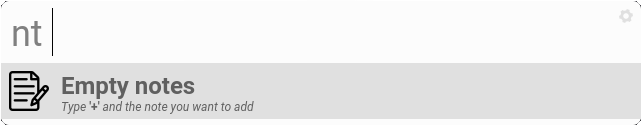
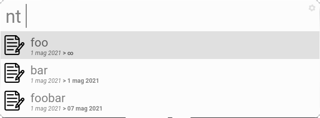

# Albert-notes
Simple python extension for [albert](https://github.com/albertlauncher/albert) launcher that allows you to organize your notes, with dates.

# Installation
Just clone the repository:

    git clone https://github.com/TheRealLorenz/albert-notes.git

And run the ./install.sh script:

    cd albert-notes
    chmod +x install.sh
    ./install.sh

Albert will most likely crash, so restart it.

After that go to Settings > Extensions > Python and enable the 'Notes' module

# Usage
Type 'nt ' inside [albert](https://github.com/albertlauncher/albert) to activate the extension.

  
## Insert note

Just type 'nt + *SOMETEXT*' to add *SOMETEXT* to the notes.

It will have no expire date, just a ∞.

## Insert note with expire date

Type 'nt + *SOMETEXT* **x** *SOMEDATE*' to add *SOMETEXT* to the notes with *SOMEDATE* as the expire date.

*SOMEDATE* can be a string in the format *'gg mm yy'* or even *'today'/'tomorrow'*.

**NOTE: expire date is just a reminder, the note won't be canceled after *SOMEDATE*.**

**SECOND NOTE: *'today'* and *'tomorrow'* are just aliases for dates.**

## Remove note

Launch the extension with 'nt ' and simply press Enter on the desired note.
